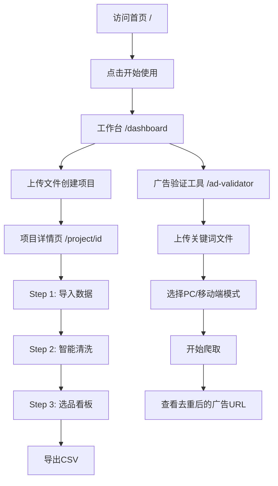

# NicheMiner 项目阶段性总结

> **总结时间**: 2024年12月24日  
> **项目版本**: v0.2  
> **开发状态**: 核心功能已完成，进入优化阶段

---

## 📊 项目概览

**NicheMiner**（利基挖掘器）是一个专为电商和SEO从业者设计的**关键词选品智能工具系统**。通过自动化数据分析、智能分词筛选和商业价值验证，帮助用户快速识别具有商业价值的"蓝海关键词"。

### 核心价值
- 🎯 **精准选品**: 从海量关键词中快速筛选高价值关键词
- ⚡️ **效率提升**: 自动化处理，人工判断效率提升10倍+
- 💰 **商业验证**: 百度广告验证，识别同行已验证的ROI关键词
- 📊 **数据洞察**: 可视化分析，蓝海评分算法

---

## ✅ 已完成功能模块

### 1. 核心业务功能 ✨

#### 1.1 多项目管理工作台
- ✅ **硅谷风格落地页** (`/`)
  - 现代化渐变UI设计
  - Hero区域展示产品价值
  - 6个功能特性卡片展示
  - 三步工作流程说明
  - 登录/注册入口（UI已就绪）

- ✅ **项目工作台** (`/dashboard`)
  - 项目列表展示
  - 项目信息显示（名称、创建时间、关键词数量）
  - 文件上传创建新项目
  - 支持CSV、XLSX、XLS格式
  - 项目删除功能

- ✅ **项目详情页** (`/project/[id]`)
  - 智能步骤导航（自动判断项目状态）
  - 三步流程集成
  - 返回工作台功能

#### 1.2 数据导入模块 (Step 1)
- ✅ **多格式支持**
  - CSV文件（GB18030编码自动处理）
  - XLSX格式
  - XLS格式

- ✅ **智能解析**
  - 自动识别表头位置（查找"关键词"列）
  - 支持表头偏移（前5行扫描）
  - 字段映射：PC流量、移动流量、竞争度

- ✅ **批量处理**
  - 支持10万+数据量导入
  - 批量插入数据库（500条/批）
  - 实时进度显示

- ✅ **数据清洗**
  - 特殊值处理（"-"、"未收录" → 0）
  - 自动计算总搜索量（PC + 移动）
  - 数据验证和错误提示

#### 1.3 智能清洗模块 (Step 2)
- ✅ **中文分词**
  - 使用segmentit库进行分词
  - 随机采样5000条待处理关键词
  - 提取Top 100高频特征词

- ✅ **级联操作**
  - "是产品"按钮：批量保留相关关键词
  - "垃圾"按钮：批量删除相关关键词
  - RPC函数：`set_valid_by_token` / `clean_by_token`

- ✅ **自动清洗规则**
  - 流量过滤：低流量关键词自动剔除
  - 数字过滤：纯数字关键词剔除
  - 长度过滤：过长关键词剔除

- ✅ **状态持久化**
  - localStorage保存已处理特征词
  - 刷新页面不丢失进度

#### 1.4 选品看板模块 (Step 3)
- ✅ **蓝海评分算法**
  ```
  蓝海分 = 搜索量 / (竞争度 + 1)
  ```
  - 搜索量越高 → 分数越高
  - 竞争度越低 → 分数越高
  - 分数越高 → 性价比越高（蓝海潜力越大）

- ✅ **数据可视化**
  - Top 100关键词榜单
  - 散点图展示流量vs竞争度分布
  - 实时统计（有效关键词数、已剔除数）

- ✅ **批量导出**
  - CSV格式导出（Excel兼容）
  - 自定义字段映射（中文列名）
  - 分页导出（1000条/批）
  - UTF-8 BOM编码

### 2. 百度广告验证工具 🔍

#### 2.1 Python爬虫脚本 (`baidu_ad_validator.py`)
- ✅ **核心功能**
  - 批量搜索关键词
  - 自动检测百度广告标识
  - 提取广告标题和链接
  - 自动截图保存
  - 结果导出Excel

- ✅ **反反爬策略**
  - 隐藏`navigator.webdriver`属性
  - 真实User-Agent轮换
  - 随机等待时间（2-5秒）
  - 模拟人类行为（鼠标移动、延迟输入）
  - JavaScript注入（locale、timezone、geolocation）
  - 双策略搜索（交互式搜索 + URL直接搜索）

- ✅ **平台过滤**
  - 自动过滤：京东、阿里巴巴、1688、爱采购、知乎、天猫
  - 域名提取和匹配
  - 可配置过滤列表

- ✅ **代理支持**
  - 单代理模式
  - 多代理轮换（5个IP自动切换）
  - 环境变量配置

- ✅ **移动端支持**
  - 移动端User-Agent模拟
  - 移动端viewport设置
  - 移动端/PC端模式切换

#### 2.2 Web集成界面 (`/ad-validator`)
- ✅ **前端功能**
  - 文件上传（Excel/CSV）
  - PC端/移动端爬取按钮
  - 实时日志控制台
  - 结果显示（去重后的广告URL）
  - 代理切换显示

- ✅ **后端API** (`/api/baidu-validator`)
  - 文件接收和处理
  - Python脚本调用
  - 代理轮换管理（5个IP）
  - Server-Sent Events (SSE) 实时日志流
  - 结果去重和聚合

- ✅ **实时反馈**
  - 进度显示（X/总数）
  - 代理切换通知
  - 错误处理和提示
  - 结果统计（总关键词数、有广告数、唯一广告数）

---

## 🛠 技术架构

### 前端技术栈
```
Next.js 16.0.7         # React全栈框架
React 19.2.0           # UI框架
TypeScript 5           # 类型安全
Tailwind CSS 4         # 原子化CSS
Recharts 3.5.1         # 数据可视化
PapaParse 5.5.3        # CSV解析
Segmentit 2.0.3        # 中文分词
XLSX 0.18.5            # Excel文件处理
Lucide React           # 图标库
```

### 后端技术栈
```
Supabase (PostgreSQL)  # 数据库 + BaaS
Next.js API Routes     # 后端API
Python 3.x             # 爬虫脚本
Playwright (Sync API)  # 浏览器自动化
Pandas                 # 数据处理
OpenPyXL               # Excel读写
```

### 基础设施
- **数据库**: Supabase PostgreSQL
- **实时通信**: Server-Sent Events (SSE)
- **文件存储**: 本地临时存储（temp目录）
- **缓存**: localStorage（前端）、IndexedDB（计划中）

---

## 📁 项目结构

```
niche-miner/
├── docs/                           # 文档目录
│   ├── 项目说明.md                 # 项目总览文档
│   ├── 项目重构说明.md             # 重构历史记录
│   ├── 项目阶段性总结.md           # 本文档
│   ├── task_mvp.md                 # 优化任务清单
│   ├── 长尾词筛选功能优化建议.md   # 优化方案
│   ├── 百度关键词验证工具说明.md   # 广告验证工具文档
│   ├── 反反爬策略说明.md           # 反爬虫策略
│   └── 商业意图打分功能设计.md     # 功能设计文档
│
├── src/
│   ├── app/
│   │   ├── page.tsx                # 落地页（硅谷风格）
│   │   ├── layout.tsx              # 根布局
│   │   ├── dashboard/              # 工作台
│   │   │   └── page.tsx
│   │   ├── project/[id]/           # 项目详情
│   │   │   └── page.tsx
│   │   ├── ad-validator/           # 广告验证工具
│   │   │   └── page.tsx
│   │   ├── login/                  # 登录页（UI占位）
│   │   │   └── page.tsx
│   │   ├── register/               # 注册页（UI占位）
│   │   │   └── page.tsx
│   │   ├── components/             # React组件
│   │   │   ├── StepImport.tsx      # 数据导入
│   │   │   ├── StepRules.tsx       # 智能清洗
│   │   │   └── StepDashboard.tsx   # 选品看板
│   │   └── api/
│   │       └── baidu-validator/    # 广告验证API
│   │           └── route.ts
│   ├── lib/
│   │   └── supabaseClient.ts       # Supabase客户端
│   └── types.d.ts                  # TypeScript类型定义
│
├── baidu_ad_validator.py           # Python爬虫脚本
├── requirements.txt                # Python依赖
├── package.json                    # Node.js依赖
└── README.md                       # 项目README
```

---

## 🗄️ 数据库设计

### 表结构

#### `projects` 表
```sql
{
  id: UUID (主键)
  name: string (项目名称)
  created_at: timestamp
}
```

#### `keywords` 表
```sql
{
  id: UUID (主键)
  project_id: UUID (外键 → projects.id)
  term: string (关键词文本)
  pc_volume: number (PC日检索量)
  mobile_volume: number (移动日检索量)
  search_volume: number (总搜索量)
  competition: number (竞争激烈程度)
  status: enum('pending' | 'valid' | 'trash')
  created_at: timestamp
  updated_at: timestamp
}
```

### Supabase RPC函数

| 函数名 | 功能 | 参数 |
|--------|------|------|
| `get_project_stats` | 获取项目统计 | `p_id` |
| `set_valid_by_token` | 按特征词批量保留 | `p_id`, `token` |
| `clean_by_token` | 按特征词批量删除 | `p_id`, `token` |
| `clean_rule_volume` | 流量规则清洗 | `p_id` |
| `clean_rule_digits` | 数字规则清洗 | `p_id` |
| `clean_rule_long` | 长度规则清洗 | `p_id` |
| `reset_project_status` | 重置项目状态 | `p_id` |

---

## 📈 核心工作流程

### 完整用户流程



### 数据处理流程

```
文件上传
  ↓
创建项目记录 (projects表)
  ↓
解析文件（CSV/XLSX/XLS）
  ↓
批量插入关键词 (keywords表，status='pending')
  ↓
智能清洗：
  - 分词提取特征词
  - 用户人工判断
  - 级联更新状态 (valid/trash)
  ↓
选品看板：
  - 计算蓝海分
  - 排序Top 100
  - 可视化展示
  ↓
导出CSV文件
```

---

## 🎯 项目亮点

### 1. 技术创新 ⚡️
- **Web Worker分词处理**（计划中）：解决大规模数据前端性能问题
- **Server-Sent Events实时日志**：Python脚本与前端实时通信
- **多代理IP轮换**：提高爬虫稳定性和成功率
- **双策略搜索**：交互式搜索 + URL直接搜索，提高容错性

### 2. 用户体验 🎨
- **硅谷风格设计**：现代化、专业化的UI设计
- **智能步骤导航**：自动判断项目状态，引导用户流程
- **实时反馈**：进度条、日志、Toast提示
- **批量操作**：一键处理数千条关键词

### 3. 商业价值 💰
- **蓝海评分算法**：量化关键词性价比
- **广告验证工具**：识别同行已验证的ROI关键词
- **多项目支持**：管理多个选品项目
- **数据可视化**：直观展示关键词分布

---

## 🚧 待优化功能

### 高优先级（立即实施）
1. ⬜ **Web Worker分词处理** - 解决UI阻塞问题
2. ⬜ **关键词搜索和过滤** - 提升用户体验
3. ⬜ **关键词预览功能** - 帮助用户决策
4. ⬜ **数据库索引优化** - 提升查询性能
5. ⬜ **分词结果缓存** - 减少重复计算

### 中优先级（近期实施）
6. ⬜ **批量操作功能** - 多选特征词批量处理
7. ⬜ **增量分词处理** - 分批处理，实时反馈
8. ⬜ **操作历史记录** - 支持撤销功能
9. ⬜ **操作反馈优化** - Toast提示、实时统计

### 低优先级（长期规划）
10. ⬜ **TF-IDF加权算法** - 优化特征词排序
11. ⬜ **商业意图评分** - 结合商业词典加权
12. ⬜ **智能采样策略** - 分层采样，提高代表性
13. ⬜ **动态停用词学习** - 自动学习用户偏好
14. ⬜ **词云可视化** - 增强数据展示
15. ⬜ **用户认证系统** - 登录/注册功能完善

> 详细任务清单见：`docs/task_mvp.md`

---

## 📊 性能指标

### 当前性能
- **数据导入**: 支持10万+关键词，批量插入500条/批
- **分词处理**: 5000条关键词约5-10秒（主线程，有UI阻塞）
- **数据库查询**: 随机采样5000条约5-10秒（需优化）
- **爬虫效率**: PC/移动端双模式，5代理轮换，单关键词约3-5秒

### 优化目标
- **分词速度**: 提升5-10倍（使用Web Worker）
- **查询速度**: 提升3-5倍（添加索引）
- **UI响应**: 从阻塞变为流畅
- **操作效率**: 批量操作提升50%+效率

---

## 🐛 已知问题

### 技术债务
1. **UI阻塞问题**: 分词处理在主线程执行，导致UI卡顿
2. **查询性能**: 随机采样使用`.range()`，大数据量下性能差
3. **缓存缺失**: 分词结果未缓存，每次刷新都重新计算
4. **错误处理**: 部分边界情况缺少错误提示

### 功能缺失
1. **用户系统**: 登录/注册功能未实现，目前无用户隔离
2. **数据备份**: 无数据导出/备份功能
3. **操作历史**: 无法撤销操作，无操作日志
4. **配置管理**: 清洗规则、停用词等无法自定义配置

---

## 📚 文档完整性

### 已完成的文档 ✅
- ✅ `docs/项目说明.md` - 项目总览和技术文档
- ✅ `docs/项目重构说明.md` - 重构历史记录
- ✅ `docs/项目阶段性总结.md` - 本文档
- ✅ `docs/task_mvp.md` - 优化任务清单
- ✅ `docs/长尾词筛选功能优化建议.md` - 优化方案
- ✅ `docs/百度关键词验证工具说明.md` - 广告验证工具文档
- ✅ `docs/反反爬策略说明.md` - 反爬虫策略文档
- ✅ `docs/商业意图打分功能设计.md` - 功能设计文档

### 待补充的文档 ⬜
- ⬜ API接口文档
- ⬜ 数据库Schema详细文档
- ⬜ 部署运维文档
- ⬜ 用户使用手册

---

## 🎓 技术难点与解决方案

### 难点1: 百度反爬虫机制
**问题**: 百度检测到自动化工具，搜索框不可见  
**解决方案**: 
- 隐藏`navigator.webdriver`
- JavaScript注入（locale、timezone等）
- 双策略：交互式搜索 + URL直接搜索
- 模拟人类行为（随机延迟、鼠标移动）

### 难点2: 前端分词性能问题
**问题**: 5000条关键词分词阻塞UI线程  
**解决方案（计划中）**:
- 使用Web Worker在后台线程处理
- 增量分批处理
- 结果缓存到IndexedDB

### 难点3: Python脚本与前端实时通信
**问题**: 需要在爬虫过程中实时显示日志  
**解决方案**:
- Server-Sent Events (SSE)
- Python脚本stdout实时流式输出
- 前端EventSource监听

### 难点4: 多代理IP轮换
**问题**: 需要自动切换多个代理IP  
**解决方案**:
- 环境变量配置5个代理
- API路由管理代理索引
- 每个关键词切换代理
- SSE通知前端代理切换

---

## 🚀 未来规划

### 短期目标（1-2个月）
1. 完成高优先级优化任务（Web Worker、搜索、预览、索引）
2. 完善用户认证系统
3. 添加操作历史记录
4. 优化UI/UX体验

### 中期目标（3-6个月）
1. 实现智能算法优化（TF-IDF、商业意图评分）
2. 添加更多可视化图表
3. 支持自定义清洗规则配置
4. 数据备份和恢复功能

### 长期目标（6-12个月）
1. 多用户协作功能
2. API开放平台
3. 移动端APP
4. AI辅助决策（智能推荐）

---

## 💡 项目价值总结

### 对用户的价值
- ⏱️ **时间节省**: 从数天筛选缩短到数小时
- 🎯 **精准选品**: 蓝海评分算法量化关键词价值
- 💰 **商业验证**: 广告验证工具识别已验证ROI的关键词
- 📊 **数据洞察**: 可视化分析，直观了解市场情况

### 对项目的价值
- 🏗️ **架构清晰**: Next.js全栈架构，易于扩展
- 🔧 **技术栈现代**: React 19、TypeScript、Tailwind CSS 4
- 📈 **可扩展性**: 模块化设计，易于添加新功能
- 📚 **文档完善**: 详细的文档和任务清单

---

## 📝 总结

NicheMiner项目已完成**核心MVP功能**，包括：
- ✅ 多项目管理
- ✅ 数据导入和清洗
- ✅ 智能分词筛选
- ✅ 选品看板
- ✅ 百度广告验证工具

项目已进入**优化和增强阶段**，有明确的优化任务清单和实施路线图。技术架构合理，文档完善，为后续迭代打下了良好基础。

**下一步**: 按照`docs/task_mvp.md`中的任务清单，优先实施性能优化相关任务，提升用户体验。

---

**文档版本**: 1.0  
**创建日期**: 2024-12-24  
**维护者**: NicheMiner 开发团队

